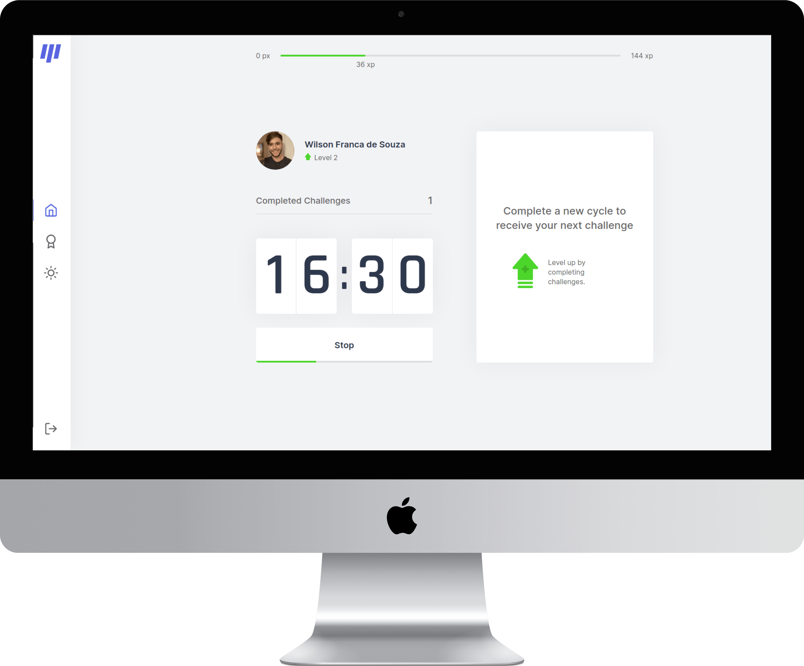

<p align="center">
  
  <a href="https://github.com/wilsonfsouza/happy-frontend-web/commits/main">
    
  </a>

   


  <a href="https://www.linkedin.com/in/wilsonfsouza/">
    
  </a>
</p>

<h1 align="center">
    <p align="center">
  
</p>
</h1>

<h4 align="center">
  Table of contents
</h4>

<p align="center">
 <a href="#-about-the-project">About</a> •
 <a href="#user-content-️-features">Features</a> •
 <a href="#-layout">Layout</a> •
 <a href="#-how-to-run-the-project">How to run</a> •
 <a href="#-technologies">Technologies</a> •
 <a href="#-author">Author</a> •
 <a href="#user-content--license">License</a>
</p>


## 💻 About the project

Smart.it is a web application that combines a gamified experience of the pomodoro technique with healthy exercises between short breaks of work/study sessions. Keep up with your productivity without sacrificing your health. Smart.it is the dream application of chiropractors and eye doctors for their patients.

---

## ⚙️ Features

- Authentication using GitHub (OAuth).

- Userd can level up by completing challenges.

- Challenges are available after a 25-minute work/study session.

- Users can use application on desktop, tablet, and mobile devices.

---

## 🎨 Layout

<br />
<p align="center">
  
</p>
<br />
<br />
<p align="center">
  
</p>
<br />
<br />
<p align="center">
  
</p>
<br />
<p align="center">
  
</p>
<br />

---

## 🚀 How to run the project

### Requirements

Initial requirements:
[git](https://git-scm.com), [yarn](https://yarnpkg.com/), and a code editor of your choice.


#### Running the web application (Frontend)

```bash
# Clone this repository
$ git clone git@github.com:wilsonfsouza/focus-tracker-next.git

# Access the folder in your terminal/cmd/cli
$ cd focus-tracker-next

# Install all dependencies
$ yarn install

# Start the app in development mode
$ yarn dev

# The application will open at port:3000 - access http://localhost:3000
```

---

## 🛠 Technologies

The following tools were used in this project:

#### **Website**  ([NextJS](https://nextjs.org/)  +  [TypeScript](https://www.typescriptlang.org/))

-   **[ReactJS](https://reactjs.org/)**
-   **[OAuth](https://next-auth.js.org/configuration/providers)**
-   **[React Icons](https://react-icons.github.io/react-icons/)**
-   **[Styled-components](https://styled-components.com/)**
-   **[Jest](https://jestjs.io/)**
-   **[ESLint](https://eslint.org/)**
-   **[Prettier](https://prettier.io/)**
-   **[EditorConfig](https://editorconfig.org/)**

> See the file  [package.json](https://github.com/wilsonfsouza/focus-tracker-next/blob/master/package.json)

#### [](https://github.com/wilsonfsouza/focus-tracker-next#utilities)**Utilities**

-   Editor: **[Visual Studio Code](https://code.visualstudio.com/)**
-   Markdown: **[Markdown Emoji](https://gist.github.com/rxaviers/7360908)**
-   Icons: **[Feather Icons](https://feathericons.com/)**

---

## 💪 How to contribute to this project

1. **Fork** the project.
2. Start a new branch with your changes: `git checkout -b my-new-feature`
3. Save it and create a commit message describing what you have done: `git commit -m "feature: My new feature"`
4. Send your alterations: `git push origin my-feature`


---

## 👨‍💻 Author

<br/>
<h3>
 
 <br />
 <sub>Wilson Franca</sub></h3>
 <br />

[](https://www.linkedin.com/in/wilsonfsouza/)
[](mailto:wilson.franca.92@gmail.com)

---

## 📝 License

This project is being developed under [MIT License](./LICENSE).

Made with ❤️ by Wilson Franca 👋

